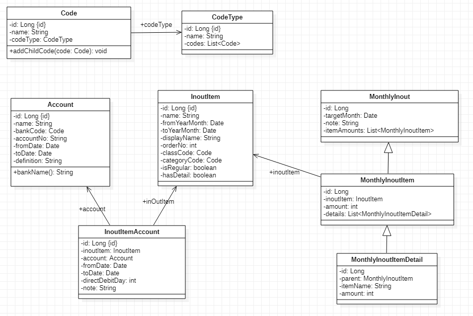
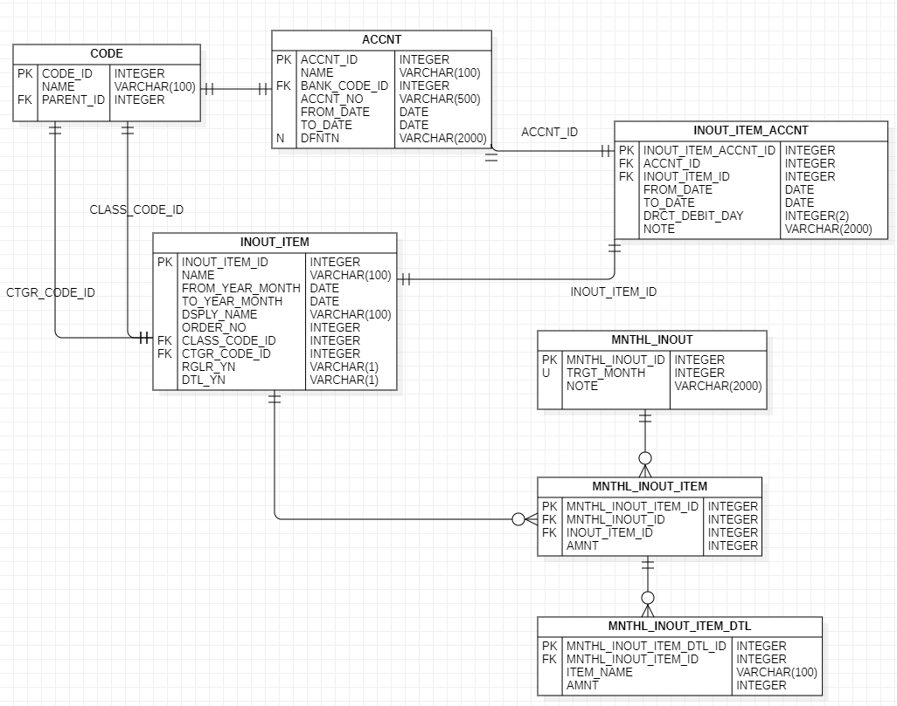

# MONEY FLOW

월별 수입/지출 내역을 관리하는 서비스. 개인 프로젝트

## 화면 목록

- [ ] 코드관리 : 서비스에서 사용할 공통코드를 관리
- [ ] 계좌관리 : 은행 또는 금융기관의 계좌를 관리
- [ ] 입출항목관리 : 돈이 들어오는 또는 돈이 나가는 항목들에 대한 관리
- [ ] 입출항목계좌연결 : 입출항목이 어떤 계좌를 사용하는지에 대한 매핑 화면
- [ ] 월별입출금액입력 : 월별로 수입 또는 지출금액을 입력
- [ ] 월별입출금액현황 : 월별로 입력한 수입/지출금액에 대한 현황 화면

## 도메인 클래스다이어그램

## ERD

## 기술 스펙
### Back-End
- java11
- springboot
- jpa
